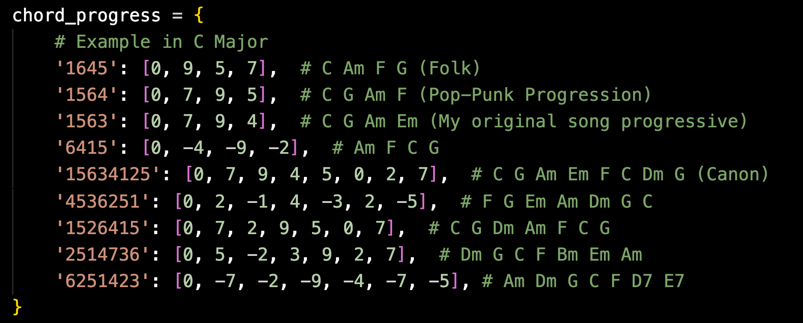
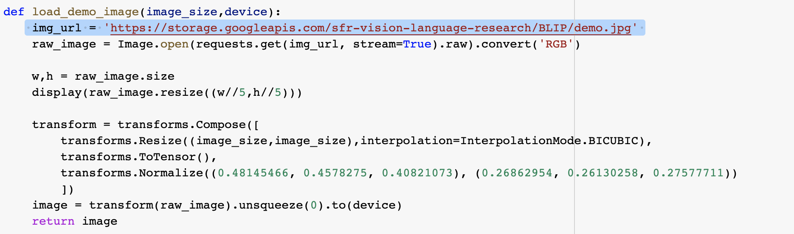
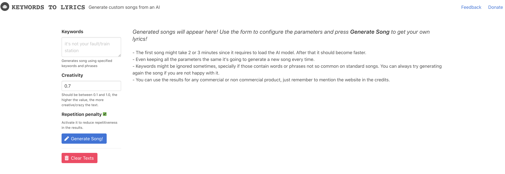

# BGT-G2G

Code for paper "Retaining Semantics in Image to Music Conversion"

## Introduction


## Usage

### Image to Music

#### Direct Conversion

Firstly, `cd ./img2MIDI`, we have an example content input, `Amily.jpeg`, and a style input (P.S. a piece of original work from my band), `style.mid`.

For `Find Closest, Triad Mapping, Range of Verious Instruments` approach:

```
python image2MIDI.py <image_path> <interval> <chord_progress_type>
```

For `Color + Chord Progression` approach:

```
python imageColor2MIDI.py <image_path> <interval> <chord_progress_type>
```

Tips:

    interval: duration of key notes: a float number

    chord_progress_type: choose from the chord progress dictionary.



To show a histogram of the midi file:

```
cd img2MIDI
python histogram_mid.py <file>.mid
```

#### Content Extraction

Firstly, provide a content input of picture.

Then try this interactive demo [BLIP: Inference Demo](https://colab.research.google.com/github/salesforce/BLIP/blob/main/demo.ipynb) for image captioning.

The only thing we need to modify is to upload the image and replace the image url here:



And we get the captioning result.

Next, input the captioning result to GPT-2 Model, where you can find an interface [here](https://lyrics.mathigatti.com/).



Next, we get the lyrics, and we need to feed it into TeleMelody.

### TeleMelody: Lyrics to Music

#### 1.1 Lyric-to-Rhythm

(1) Prepare lyric-to-rhythm dataset. Several examples are provided in directory `data/en_example` and `data/zh_example`. We can follow the pipeline mentioned in [paper](https://arxiv.org/pdf/2109.09617.pdf) to get the training data.

(2) Train lyric-to-rhythm model.

```shell
cd training/lyric2rhythm/
bash train.sh data/example example 8192
```

#### 1.2 Template-to-Melody

(1) Prepare [lmd-matched](https://colinraffel.com/projects/lmd/) MIDI dataset.

```shell
cd training/template2melody/
wget http://hog.ee.columbia.edu/craffel/lmd/lmd_matched.tar.gz
tar -xzvf lmd_matched.tar.gz
```

(2) Generate training data and alignments.

```shell
python gen.py lmd_matched lmd_matched
python gen_align.py lmd_matched
```

(3) Train template-to-melody model.

```shell
bash preprocess.sh lmd_matched lmd_matched
bash train.sh lmd_matched
```

#### 2. Inference

2.1 Modify `miditoolkit` to support Chinese lyrics.

(1)

```shell
git clone https://github.com/YatingMusic/miditoolkit.git
cd miditoolkit
```

(2) Modify `miditoolkit/midi/parser.py`.

      raw:

```python
   318    def dump(self,
   319              filename=None,
   320              file=None,
   321              segment=None,
   322              shift=True,
   323              instrument_idx=None):
   ...
   371 midi_parsed=mido.MidiFile(ticks_per_beat=self.ticks_per_beat)
```

      Modified:

```python
   318    def dump(self,
   319              filename=None,
   320              file=None,
   321              segment=None,
   322              shift=True,
   323              instrument_idx=None,
   324              charset ='latin1'):
   ...
   372 midi_parsed=mido.MidiFile(ticks_per_beat=self.ticks_per_beat, charset=charset)
```

(3) Install `miditoolkit`.

```shell
pip uninstall miditoolkit
python setup.py install
```

2.2 Save checkpoints in `checkpoints/{model_prefix}` and dictionary in `data-bin/{model_prefix}`.

2.3 Prepare word-level (EN) or character-level (ZH) lyrics in `data/{lang}/{data_prefix}/lyric.txt` and chord progression in `data/{lang}/{data_prefix}/chord.txt`. For English lyrics, additionally prepare syllable-level lyrics in `data/en/{data_prefix}/syllable.txt` as the input of lyric-to-rhythm model. Examples are provided in `data/en/test/` and `data/zh/test/`.

2.4 Infer.

Firstly, copy files in `./training/xxx/data-bin/yyy` to `./inferrence/data-bin/yyy`, and also copy the checkpoints from `./training/xxx/checkpoints/yyy` to `./inferrence/checkpoints/yyy`.

```shell

cd inference/
(EN):
python infer_en.py {en_lyric2rhythm_prefix} {template2melody_prefix} {en_data_prefix} {en_save_prefix}

(ZH):
python infer_zh.py {zh_lyric2rhythm_prefix} {template2melody_prefix} {zh_data_prefix} {zh_save_prefix}
```

Results are saved in directory `results/{save_prefix}/midi/`.

### Music Style Migration

Firstly, `cd ./groove2groove`

#### Installation

1. Install the dependencies using one of the following options:

   - Create a new environment using conda:

     ```sh
     conda env create -f environment.yml
     ```

     This will also install the correct versions of Python and the CUDA and CuDNN libraries.

   - Using pip (a virtual environment is recommended):
     ```sh
     pip install -r requirements.txt
     ```
     You will need Python 3.6 because we use a version of TensorFlow which is not available from PyPI for more recent Python versions.

   The code has been tested with TensorFlow 1.12, CUDA 9.0 and CuDNN 7.6.0. Other versions of TensorFlow (1.x) may work too.

2. Install the package with:
   ```sh
   pip install './code[gpu]'
   ```

#### Download Dataset

```
cd data/synth
$bash ./download.sh
$bash ./prepare.sh
```

Then there will be 3 sub folders, called `train`, `test` and `val`, and a file `groove2groove-data-v1.0.0.tar.gz` exists.

#### Train

To train the model with synth dataset, run:

```sh
python -m groove2groove.models.roll2seq_style_transfer --logdir $LOGDIR train
```

Replace `$LOGDIR` with the model directory, containing the `model.yaml` configuration file (e.g. one of the directories under [`experiments`](./experiments)).

#### Generation

To generate results with trained model: (Place the content input (MIDI) and style input (MIDI) in the folder of `./groove2groove` )

```sh
python -m groove2groove.models.roll2seq_style_transfer --logdir ./experiments/v01 run-midi \
    --sample --softmax-temperature 0.6 \
    <content>.mid <style>.mid <output>.mid
```

## Acknowledgement

Thanks for these open-sourced repositories:

1. [Groove2Groove](https://github.com/cifkao/groove2groove) by Ondřej Cífka et al.

2. [Muzic](https://github.com/microsoft/muzic) by Microsoft Research Asia

3. [BLIP](https://github.com/salesforce/BLIP) by salesforce
